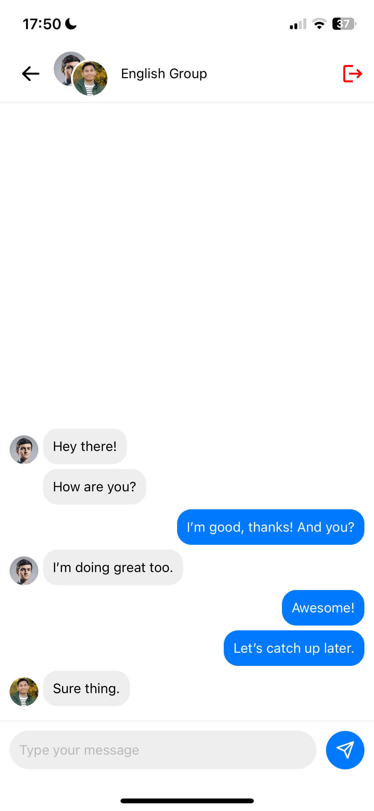

# 📚 StudyBuddy – Plateforme de mentorat pour étudiants

Bienvenue sur **StudyBuddy**, une application conçue pour connecter les étudiants entre eux à travers un système de **mentorat**, de **groupes d’étude**, et de **ressources partagées**. Que tu sois à la recherche d’un mentor pour t’accompagner dans ton parcours scolaire ou que tu souhaites aider les autres en partageant tes connaissances, StudyBuddy est fait pour toi.

## ✨ Fonctionnalités

- 🔍 **Recherche de mentor** : Trouve un mentor selon ta matière, ton niveau et tes objectifs.
- 🤝 **Deviens mentor** : Crée un profil de mentor pour aider d’autres étudiants.
- 💬 **Messagerie instantanée** : Communique en temps réel avec tes mentors et tes camarades d’étude.
- 📅 **Organisation de sessions** : Planifie des sessions de travail en ligne ou en présentiel.
- 📁 **Partage de ressources** : Télécharge et échange des fichiers et documents utiles.
- 📊 **Suivi de progrès** : Visualise tes progrès à travers des graphiques et statistiques.

## 🖼️ Captures d’écran

### Page d’accueil  


---

### Profil d’un mentor  


---

### Messagerie instantanée  


---

### Planification d'une session  


---

## 🚀 Lancer l’application en local

```bash
git clone https://github.com/votre-utilisateur/studybuddy.git
cd studybuddy
npm install
npm run dev
